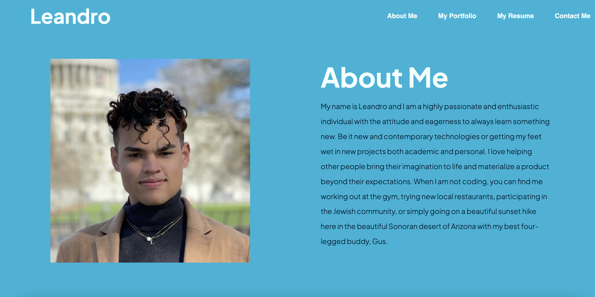

# My-ProFolio-WK2

This is the portfolio webpage that I made using both HTML and CSS. I used an extensive amount of different techniques to make my website both informative and visually appealing. I made use of the navigation bar to add anchor links to the different sections of my website as well as a link to my resume. I used different classes and IDs to create different containers within my webpage. I also made use of different resources like the Fa Icons extensions which made adding different icons like Facebook and LinkedIn much easier. I added different hover effects in my project, specifically to the social media icons, the project container holders, and the navbar. 

If you would like to take a look at my portfolio you can by clicking <a href="https://lamachad.github.io/My-ProFolio-WK2/">here!</a>

